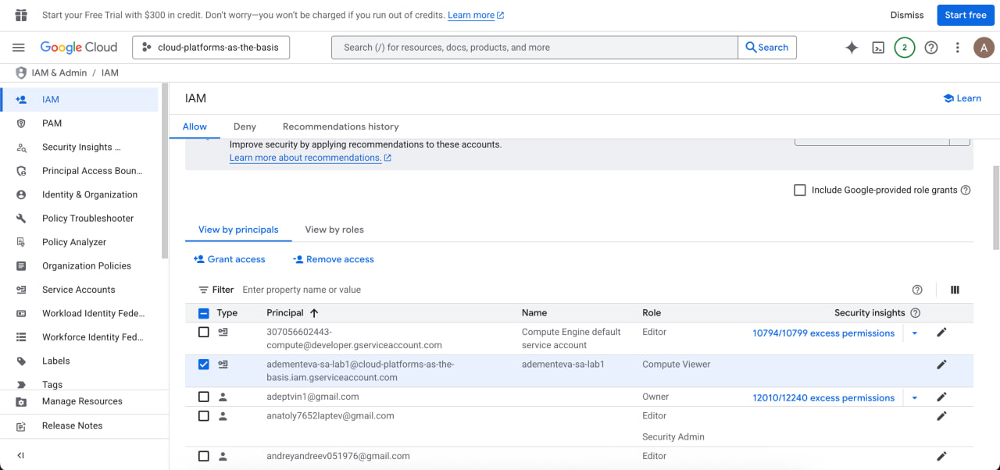
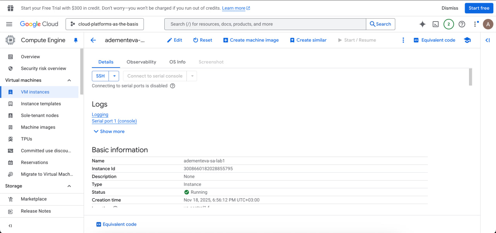
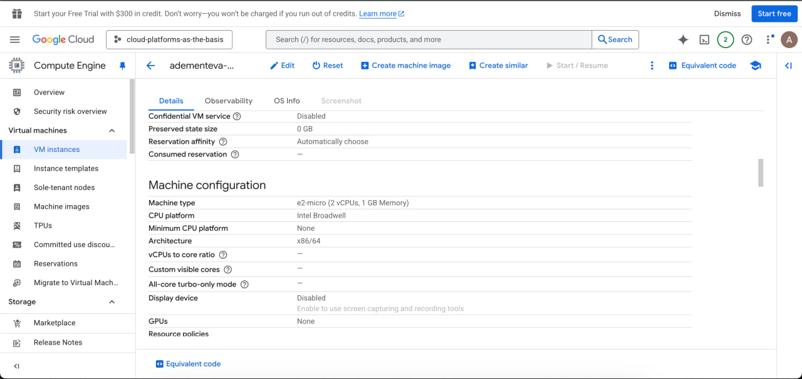
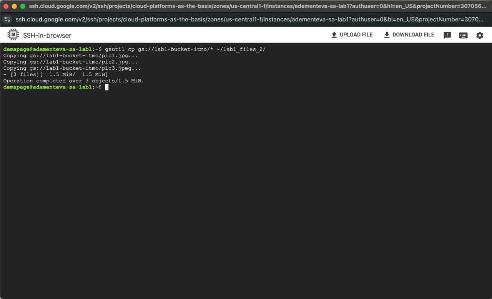

# Лабораторная работа №1

**University:** [ITMO University](https://itmo.ru/ru/)  
**Faculty:** [FICT](https://fict.itmo.ru)  
**Course:** [Introduction in Web Technologies](https://itmo-ict-faculty.github.io/introduction-in-web-tech/)  
**Year:** 2025  
**Group:** U4225  
**Author:** Ангелина Дементьева  
**Lab:** Lab0  
**Date of create:** 29.09.2025  
**Date of finished:** 29.09.2025  

## Результаты
В ходе выполнения лабораторной работы была создана виртуальная машина в Google Cloud и настроены права доступа для сервисного аккаунта. Я исследовала, как ограничения IAM-ролей и API-scope влияют на доступ к ресурсам Google Cloud Storage.

Сначала виртуальная машина использовала Compute Engine default service account с ролью Editor, поэтому команда gsutil cp успешно копировала файлы из бакета. После замены сервисного аккаунта на собственный (adementeva-sa-lab1) и удаления у него прав, связанных с Cloud Storage, а также установки API-scope уровня None, попытка скопировать файлы привела к ошибке доступа (403 AccessDenied), что подтверждает корректность настройки IAM-политик и API-ограничений.

В результате была продемонстрирована зависимость доступа к ресурсам Storage от комбинации IAM-ролей и настроек API-scope на уровне виртуальной машины.

## Скриншоты

Создание service account  с правами

 
