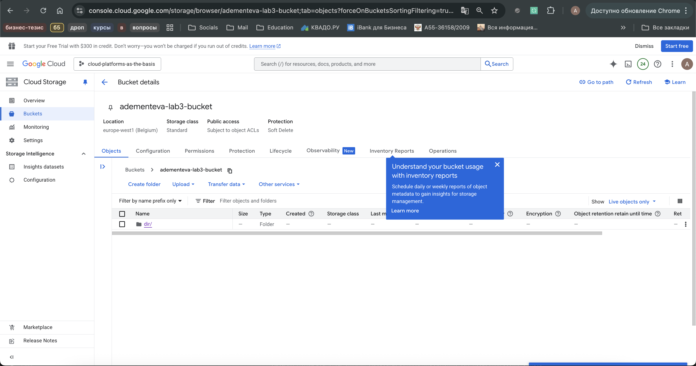
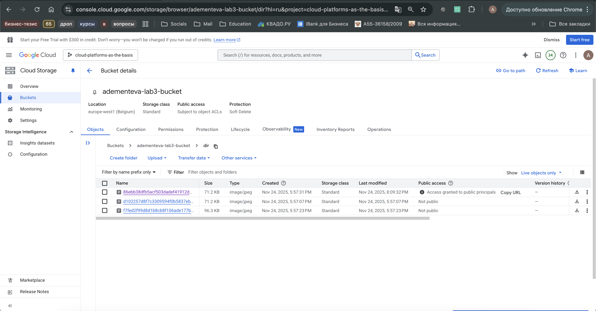
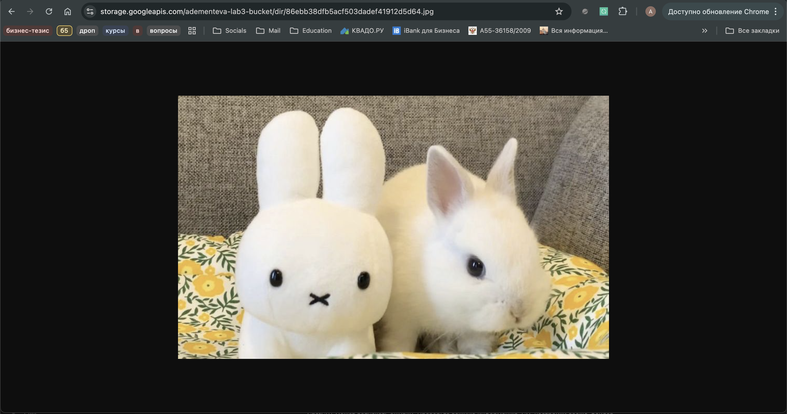

# Лабораторная работа №3

**University:** [ITMO University](https://itmo.ru/ru/)  
**Faculty:** [FICT](https://fict.itmo.ru)  
**Course:** [Introduction in Web Technologies](https://itmo-ict-faculty.github.io/introduction-in-web-tech/)  
**Year:** 2025  
**Group:** U4225  
**Author:** Ангелина Дементьева  
**Lab:** Lab0  
**Date of create:** 24.11.2025
**Date of finished:** 24.11.2025

## **1. Выбор проекта**

В консоли Google Cloud выбрала существующий проект:

```
cloud-platforms-as-the-basis
```

В этом проекте у меня уже есть необходимые разрешения, включая доступ к созданию и управлению Cloud Storage buckets.

---

## **2. Создание Cloud Storage bucket**

1. В меню слева открыла раздел **Cloud Storage → Buckets**.
2. Нажала **Create bucket**.
3. Ввела имя бакета (уникальное в глобальном масштабе):

```
adementeva-lab3-bucket
```


4. Регион выбрала **europe-west1 (Belgium)**.
5. Storage Class оставила **Standard**.
6. Access control установила **Fine-grained (Object-level ACLs)** — чтобы можно было настраивать доступ именно к отдельным файлам.
7. Создала бакет.

---

## **3. Загрузка изображений в bucket**

1. Перешла в созданный бакет.
2. Нажала **Upload files**.
3. Загрузила 3–4 изображения (JPEG/PNG).
4. Подтвердила загрузку — файлы появились в списке объектов.

---

## **4. Создание папки и перемещение файлов**

1. Внутри бакета нажала **Create folder**.
2. Создала папку с произвольным названием:

```
dir
```

3. Отметила все загруженные изображения.
4. Через меню **Move** переместила их в созданную папку `dir/`.

После перемещения пути файлов изменились на:

```
adementeva-lab3-bucket/dir/<имя_файла>.jpg
```



---

## **5. Настройка публичного доступа**

По умолчанию Cloud Storage запрещает public access.
Чтобы включить доступ по публичной ссылке, выполнила следующие шаги:

### **5.1. Открыла файл → Edit access**

1. Открыла объект → вкладка **Object details**.
2. Нажала **Edit access**.

### **5.2. Настроила читательский доступ**

Добавила новую запись:

* Entity: **Public**
* Name: **allUsers**
* Access: **Reader**

Google Cloud предупредил о риске публичного доступа — подтвердила изменения.

Теперь статус доступа отображается как:

```
Public access: Public
```

А в списке ACL появилась запись:

```
allUsers — Reader
```

### **5.3. Получила публичную ссылку**

Файлы стали доступны по URL вида:

```
https://storage.googleapis.com/adementeva-lab3-bucket/dir/<имя_файла>.jpg
```


Открыла ссылку в новом браузере (без авторизации) — изображение успешно загрузилось → значит публичный доступ настроен корректно.
