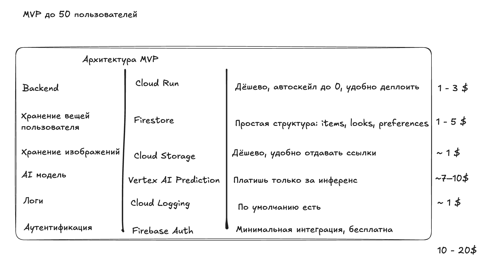
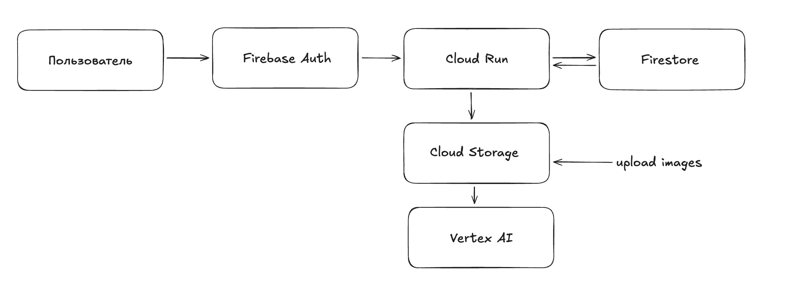
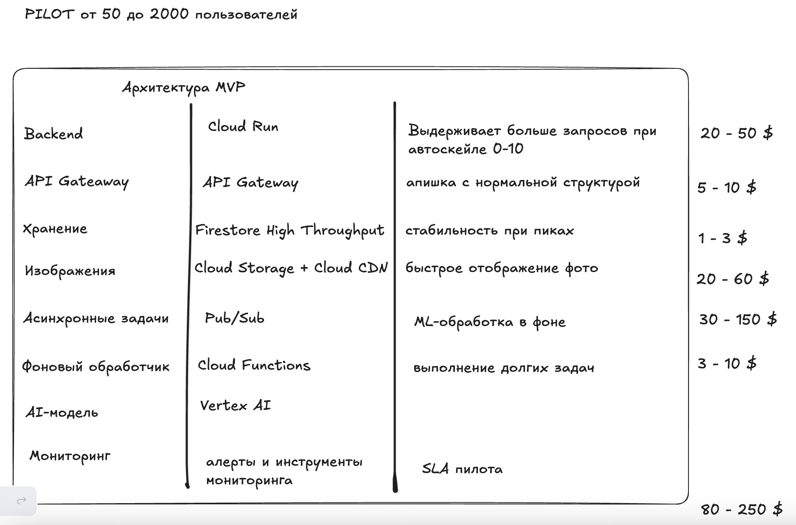
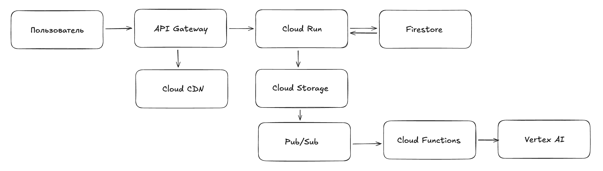
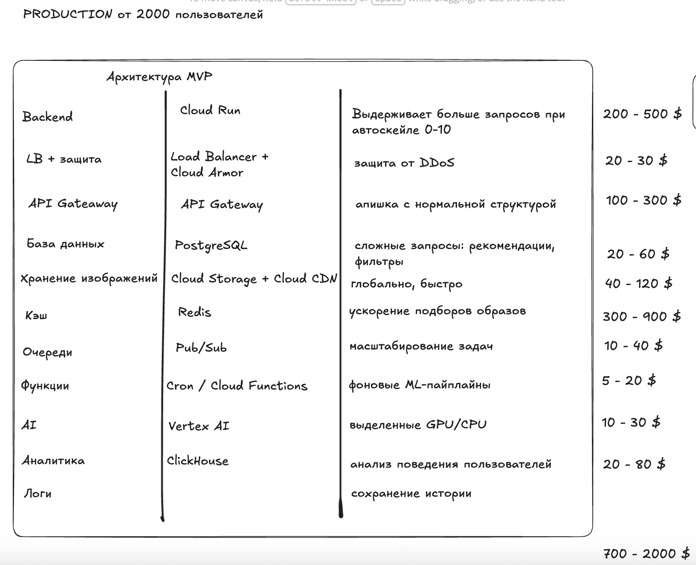
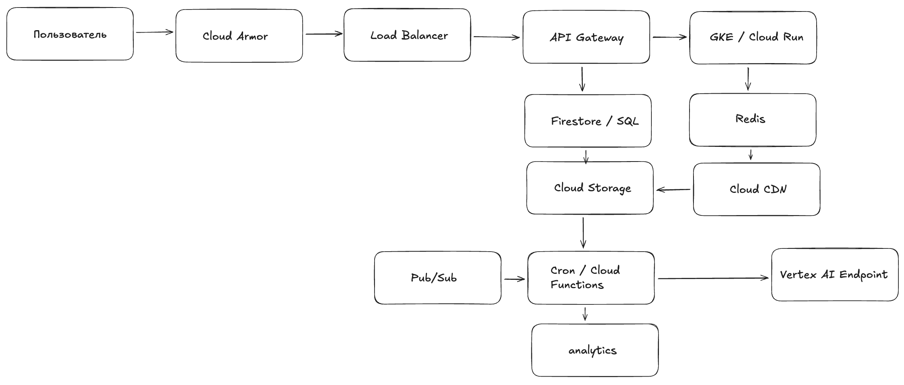

# Лабораторная работа №4

**University:** [ITMO University](https://itmo.ru/ru/)  
**Faculty:** [FICT](https://fict.itmo.ru)  
**Course:** [Introduction in Web Technologies](https://itmo-ict-faculty.github.io/introduction-in-web-tech/)  
**Year:** 2025  
**Group:** U4225  
**Author:** Ангелина Дементьева  
**Lab:** Lab0  
**Date of create:** 25.11.2025
**Date of finished:** 25.11.2025

##Цель работы

Изучить принципы проектирования облачной инфраструктуры для AI-приложений на разных стадиях развития продукта. Разработать три архитектуры для LookMatch:
начальная (MVP),
тестовая (Pilot),
продовая (Production).
Провести базовую экономическую оценку и обосновать выбор сервисов.

##1. Описание приложения LookMatch
LookMatch — это сервис, который:
распознаёт предметы одежды по фото,
анализирует стиль,
подбирает образы на основе загруженного гардероба,
рекомендует недостающие вещи.

Приложение использует ML/AI-модели для распознавания изображений и генерации рекомендаций.

##2. Архитектура MVP
Цель стадии: проверить гипотезу и работу моделей при минимальных затратах.

##3. Архитектура Pilot
Цель: тестирование с партнёрами (500–2000 пользователей/день).

##3. Архитектура Production
Цель: поддержка от 10 000 пользователей/день.

Высокая доступность, низкая задержка, кэширование, аналитика.

##4. Экономическая модель
MVP — 10–20$ / месяц
Самые дешёвые ресурсы, оплата только за вызовы Vertex AI.

Pilot — 80–250$ / месяц
Появляется CDN, Pub/Sub, больше запросов к AI.

Production — 700–2000$ / месяц
Используются SQL, Redis, Vertex AI Endpoints на GPU/CPU.
